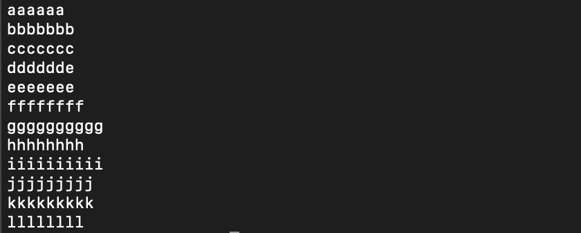
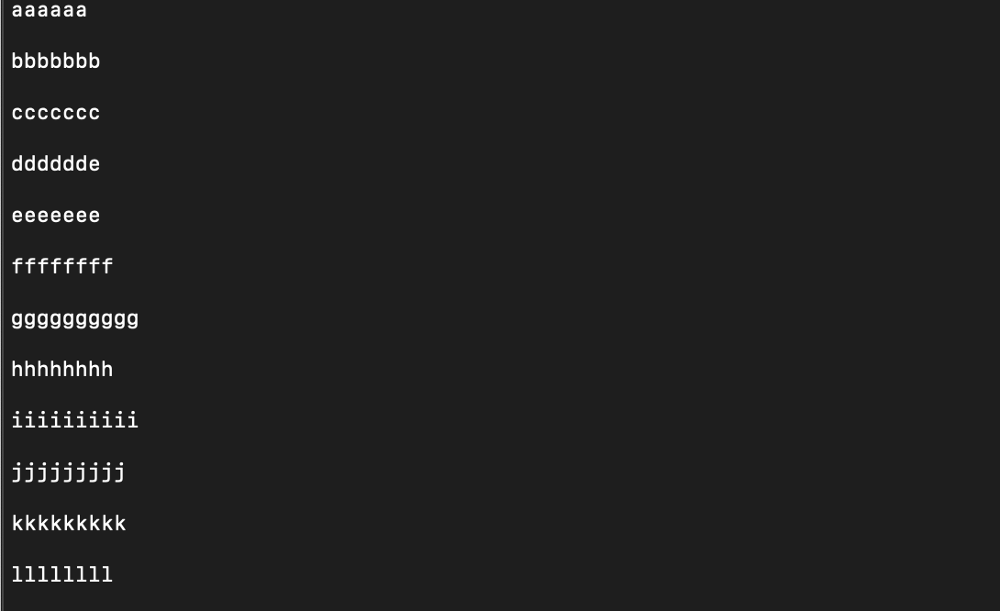

### 目录

[toc]

### 一、参数说明

```
### 命令行参数
-e			必须参数，可以用于在命令行模式直接开始Perl编程
-p			表示逐行遍历文件并按给定的命令处理后打印每一行，等价于下面代码：
		while(<>){
			# your program goes here
		}continue{
			print or die "-p failed: $! \n"
		}
-a
-n
-l
-e


### 特殊变量
$\（$ORS）			类似于awk中的ORS，输出记录分隔符，默认是\n；在每个“print”操作后添加，如果"print"没有参数。则它将打印输出"$_"的内容
$/ （$RS）			输入记录分隔符，默认是新行字符，如果用变量undef,将读到文件结尾
$! （$OS_ERROR or $ERROR）			该变量的数字是error的值，字符串是对应的系统错误字符串
$. （$NR）			前一次读的文件句柄的当前行号				
$_ （$ARG）			默认输入和模式匹配内容
```


### 二、文件分割

```
cat test.txt
```




#### 1. 使用双倍行距输出文件

```perl
perl -pe '$\="\n"' test.txt
## 等价于下面的代码

# 等价1：
while (<>) {
    $\ = &#34;\n&#34;;
} continue {
    print or die &#34;-p failed: $!\n&#34;;
}

# 等价2: BEGIN初始化代码会在所有代码执行前执行
perl -pe 'BEGIN { $\="\n"}' test.txt

# 等价3: 利用正则取代("s///"),它将在行尾匹配的正则表达式“$”替换为换行符，有效地在末尾添加换行符。
perl -pe 's/$/\n/' test.txt

```



​		**代码说明：**在读取每一行后，“$”被填充（包括现有行的换行符），“$\”被设置为换行符，并调用“print”。没有任何参数的“print”打印“$”的内容，“$\”被附加在末尾。 结果是每一行都未经修改地打印出来，后面跟着设置为换行符的“$\”。 输入是双倍行距的。


#### 2.双倍行距输出文件，除了空白行

```perl
perl -pe '$_.="\n" unless /^$/' test.txt
## 等价于下面命令
# 等价1：
while (<>) {
    if ($_ !~ /^$/) {
        $_ .= &#34;\n&#34;
    }
} continue {
    print or die &#34;-p failed: $!\n&#34;;
}

# 等价2: 正则\S是\s的反向
perl -pe '$_.="\n" if /\S/'
```


#### 3.三倍行距输出文件

```perl
perl -pe '$\="\n\n"' test.txt
or
perl -pe '$_.="\n\n"'
```


#### 4.N倍行距输出文件

```perl
# n表示倍数
perl -pe '$_.="\n"xn' test.txt
```


#### 5.在每一行前添加空白行

```perl
 perl -pe 's//\n/' test.txt 
```

